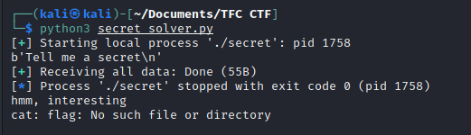
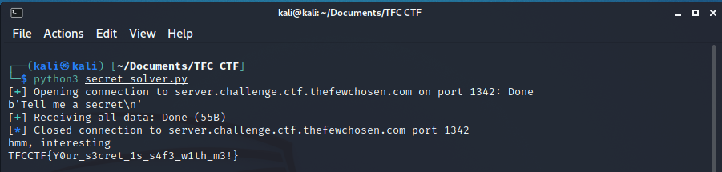

# SECRET

Challenge author: tomadimitrie

Can you tell me a secret?

## Analysis

In this challenge we were given an ELF-64bit named `secret` with no canary, NX enabled, and PIE is also enabled.

```
$ file secret; checksec secret              
secret: ELF 64-bit LSB pie executable, x86-64, version 1 (SYSV), dynamically linked, interpreter /lib64/ld-linux-x86-64.so.2, for GNU/Linux 3.2.0, BuildID[sha1]=c218ee479df643755efef28fb34263d506c68e61, not stripped
[*] '/home/kali/Documents/TFC CTF/secret'
    Arch:     amd64-64-little
    RELRO:    Partial RELRO
    Stack:    No canary found
    NX:       NX enabled
    PIE:      PIE enabled
```

Let's try to run it

```
Tell me a secret
chicken nugget
I have already heard that one, sorry
```

It seems that the program will print `I have already heard that one, sorry` if the input doesn't match the if condition. Let's open the program using ida to see what the source code looks like.

```c
int __cdecl main(int argc, const char **argv, const char **envp)
{
  char s[8]; // [rsp+0h] [rbp-20h]
  __int64 v5; // [rsp+8h] [rbp-18h]
  __int64 v6; // [rsp+10h] [rbp-10h]
  __int64 v7; // [rsp+18h] [rbp-8h]

  setvbuf(_bss_start, 0LL, 2, 0LL);
  puts("Tell me a secret");
  *(_QWORD *)s = 0LL;
  v5 = 0LL;
  v6 = 0LL;
  v7 = 0LL;
  fgets(s, 32, stdin);
  if ( *(_QWORD *)s == -6144092014192636707LL )
  {
    puts("hmm, interesting");
    system("cat flag");
    putchar(10);
  }
  else
  {
    puts("I have already heard that one, sorry");
  }
  return 0;
}
```

From the main function, it seems that we need to match the if condition. But the number is too large, let's see it in the other forms by right click the number and choose the other forms.

Let's try change it into hexadecimal
```c
if ( *(_QWORD *)s == 0xAABBCCDDAABBCCDDLL )
  {
    puts("hmm, interesting");
    system("cat flag");
    putchar(10);
  }
```

From the hexadecimal, now we know that we can use 0xAABBCCDDAABBCCDD or 0xaabbccddaabbccdd (it is the same) for the input to the challenge and we don't need to input the `LL`. Let's try input it manually
```
$ ./secret
Tell me a secret
0xaabbccddaabbccdd
I have already heard that one, sorry
```

We know that the input are correct. But it doesn't give the flags. Since the program are in 64 bit, the layout might not be match. So let's use pwntools library to pack the input into 64 bit format.

## Exploit

Let's make a solver using python
```python
from pwn import *

secret = 0xaabbccddaabbccdd

s = process("./secret")

print(s.recvline())
s.sendline(p64(secret))
print(s.recvall().decode())

s.close()
```

Now we need to do is just run the program to make sure it works!



Since it works, lets test on remote server by adding host, port and replacing `s = process("./secret")` to `s = remote(host, port)`

```python
from pwn import *

host = "server.challenge.ctf.thefewchosen.com"
port = 1342

secret = 0xaabbccddaabbccdd

s = remote(host, port)

print(s.recvline())
s.sendline(p64(secret))
print(s.recvall().decode())

s.close()
```

Now all we need to do is just run the program


Flag: `TFCCTF{Y0ur_s3cret_1s_s4f3_w1th_m3!}`
