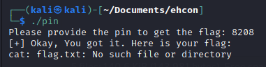
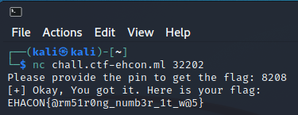

# Famous Pin

by lrcashem

Help Mr. Bean in recovering his pin. He only remembers that he had set a very famous pin. Connect at chall.ctf-ehcon.ml:32202

## Analysis

In this challenge we were given an ELF-64bit named `pinr` with everything enabled (sfx: oh no :))).
```
pin: ELF 64-bit LSB pie executable, x86-64, version 1 (SYSV), dynamically linked, interpreter /lib64/ld-linux-x86-64.so.2, BuildID[sha1]=6afd69ea26548011d618d32bb34cfa86ddc177a2, for GNU/Linux 3.2.0, not stripped
[*] '/home/kali/Documents/ehcon/pin'
    Arch:     amd64-64-little
    RELRO:    Full RELRO
    Stack:    Canary found
    NX:       NX enabled
    PIE:      PIE enabled
```

Let's try to run it
```
$ ./pin   
Please provide the pin to get the flag:
```

It seems that the program will ask for input and if we give the correct input, the program will give us the flag. So, let's open the program using ida to see what the source code looks like.
```c
int __cdecl main(int argc, const char **argv, const char **envp)
{
  __int64 v3; // rdx
  __int64 v4; // rdx
  const char *v5; // rdi
  __int64 v6; // rdx
  unsigned int v7; // eax
  int result; // eax
  unsigned __int64 v9; // rcx
  unsigned __int64 v10; // rt1
  __int16 v11; // [rsp-2Ah] [rbp-2Ah]
  unsigned __int64 v12; // [rsp-20h] [rbp-20h]

  __asm { endbr64 }
  v12 = __readfsqword(0x28u);
  sub_10F0(stdin, 0LL, envp);
  sub_10F0(stdout, 0LL, v3);
  sub_10F0(stderr, 0LL, v4);
  sub_1110("Please provide the pin to get the flag: ");
  sub_1120(&v11, 10LL, stdin);
  if ( (unsigned __int64)sub_10D0(&v11) > 4 )
  {
    v7 = sub_1130(&v11);
    if ( 8208 == (unsigned int)function(v7) )
    {
      sub_10C0("[+] Okay, You got it. Here is your flag: ");
      v5 = "cat flag.txt";
      sub_1100("cat flag.txt");
    }
    else
    {
      v5 = "[-] Naah, Try again...";
      sub_10C0("[-] Naah, Try again...");
    }
  }
  else
  {
    v5 = "The pin is too short.";
    sub_10C0("The pin is too short.");
  }
  result = 0;
  v10 = __readfsqword(0x28u);
  v9 = v10 ^ v12;
  if ( v10 != v12 )
    result = sub_10E0(v5, 10LL, v6, v9);
  return result;
}
```

From the main function, we can see the value of the pin that is hardcoded into the program. So, lets try to give `8208` as an input.


BINGO! We get the flag! But since in my folder there is no flag.txt, the program cannot give the flag.txt

Now all we need to do is just to run it remotely.


flag: `EHACON{@rm51r0ng_numb3r_1t_w@5}`