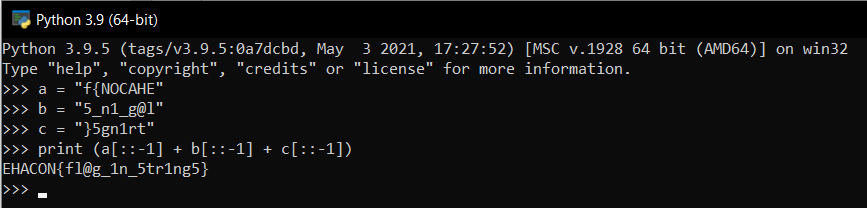

# Seeking the flag

by lrcashem

Rumors that the file may have information that you need

## Analysis

In this challenge we were given an ELF-64bit named `rev` with no canary, NX enabled, and PIE is also enabled.
```
rev: ELF 64-bit LSB pie executable, x86-64, version 1 (SYSV), dynamically linked, interpreter /lib64/ld-linux-x86-64.so.2,BuildID[sha1]=f9e34699153b5af04e617da197bd0f0e7453b73c, for GNU/Linux 3.2.0, not stripped
[*] '/home/kali/Documents/ehcon/rev'
    Arch:     amd64-64-little
    RELRO:    Partial RELRO
    Stack:    No canary found
    NX:       NX enabled
    PIE:      PIE enabled
```

Let's try to run it
```
$ ./rev
:( Try Again...
```

It seems that the program will not give any output. So, let's open the program using ida to see what the source code looks like.
```
push    rbp
mov     rbp, rsp
sub     rsp, 30h
mov     [rbp+var_24], edi
mov     [rbp+var_30], rsi
mov     rax, 667B4E4F43414845h
mov     rdx, 355F6E315F67406Ch
mov     [rbp+var_20], rax
mov     [rbp+var_18], rdx
mov     rax, 7D35676E317274h
mov     [rbp+var_10], rax
lea     rdi, format     ; ":( Try Again..."
mov     eax, 0
call    _printf
nop
leave
retn
```

From this part, we can see that there is three hexadecimal numbers that is kinda odd. When I want to change the format by right clicking on the hexadecimal number, the number represent some sort of string.
```
push    rbp
mov     rbp, rsp
sub     rsp, 30h
mov     [rbp+var_24], edi
mov     [rbp+var_30], rsi
mov     rax, 'f{NOCAHE'
mov     rdx, '5_n1_g@l'
mov     [rbp+var_20], rax
mov     [rbp+var_18], rdx
mov     rax, '}5gn1rt'
mov     [rbp+var_10], rax
lea     rdi, format     ; ":( Try Again..."
mov     eax, 0
call    _printf
nop
leave
retn
```

It seems that the flag is written and passed to a registry and the format of the flag is EHACON{some_string}. So we know that the string is reversed. Now we need to reversed it again. I'm going to use python for reversing the string.

Payload
```python
a = "f{NOCAHE"
b = "5_n1_g@l"
c = "}5gn1rt"
print (a[::-1] + b[::-1] + c[::-1])
```

Now all we need to do is just press enter


flag: `EHACON{fl@g_1n_5tr1ng5}`